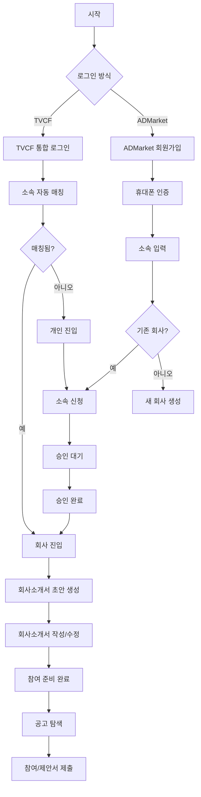

# 제작사/대행사 “가입/로그인 → 회사소개서 준비 → 참여” Flow (공통)

## 0) Entry: “참여자로 시작하기”

- 버튼/메뉴: `파트너스(참여하기)` / `프로젝트 공고` / `로그인`

---

## 1) 로그인/가입 분기

### 1-A) TVCF 통합 로그인 루트

1. `로그인` → `TVCF 통합 로그인`
2. 최초 로그인 시:
    - TVCF 기업 DB 기반 **소속 자동 매칭 시도**
3. 결과 분기:
    - **매칭 성공** → 회사 계정(또는 회사 모드)로 진입
    - **매칭 실패** → 개인 계정으로 진입 → “소속 회사 선택/신청” 화면로 유도

### 1-B) ADMarket 회원가입 루트

1. `회원가입`
2. 필수: 휴대폰 인증 + 기본정보 입력
3. `소속 입력` 단계에서 분기:
    - **기존 회사 선택** → 소속 신청(Pending)
    - **새 회사 생성** → 대표관리자 생성(회사 계정 생성)

---

## 2) 회사 소속/권한 확정(기업 구성원 승인 흐름)

### 2-A) 기존 회사 선택(소속 신청)

- 화면: `회사 선택` → `소속 신청`
- 상태: **승인대기(Pending)**
- 승인 주체: 회사의 **대표관리자/부관리자**
- 승인 완료 시:
    - 해당 구성원은 회사 구성원으로 활성화
    - 회사 관련 메뉴/기능 접근 가능

### 2-B) 새 회사 생성(대표관리자)

- 화면: `새 회사 생성`
- 결과:
    - 생성자는 대표관리자(또는 대표관리자 후보)로 시작
    - 회사 프로필(=회사소개서)이 기본 생성됨(초안)

---

## 3) 회사소개서(기업 프로필) 작성/수정 (핵심 선행 단계)

### 3-1) 회사 프로필 자동 생성(초안)

- 최초 진입 시 “기본 회사소개서”가 생성되어 있음(템플릿/자동초안)

### 3-2) 화면: 회사 프로필(회사소개서)

- 섹션(예시)
    - 회사 기본정보(로고/소개/연락처)
    - 핵심 역량/전문 분야
    - 대표 실적/대표 광고주
    - 포트폴리오(연동/업로드)
    - 수상/인증/등급(있다면)
    - 담당자(프로젝트 커뮤니케이션 담당)
- 액션
    - `작성/수정 저장`
    - `공개용/비공개용` 구분(있다면)
    - `제안서용으로 복사`(프로젝트 참여 시 활용)

> 여기까지가 “참여 준비 완료” 기준선이야.
> 

---

## 4) 프로젝트 참여(제작사/대행사 Participant)

- 화면: `프로젝트 공고`
- 액션: `참여 신청` → `제안서 제출`
- 이후: OT/PT → 선정/미선정 → 계약 → 수행

---

# 3) Mermaid (세로형, 한글, 최대한 안 깨지게/짧게)

## 3-A) “로그인/가입 → 회사소개서 → 참여 준비” (공통)



## A. 텍스트 다이어그램

```
[시작]
  |
  v
[로그인 방식 선택]
  |------------------------------|
  |                              |
  v                              v
[TVCF 통합 로그인]               [ADMarket 회원가입]
  |                              |
  v                              v
[최초 로그인/계정 생성]           [이메일/소셜/휴대폰 인증]
  |                              |
  v                              v
[소속 자동 매칭 시도]             [개인정보/소속 입력]
  |                              |
  v                              v
{소속 회사 매칭됨?}               {이미 존재하는 회사 선택?}
  |----예-------------------|     |----예-------------------|
  |                         |     |                         |
  v                         v     v                         v
[회사 계정으로 진입]       [개인 계정으로 진입]            [회사 선택(소속 신청)]     [새 회사 생성]
  |                         |     |                         |
  v                         v     v                         v
[기업 구성원 권한 확인]     [회사 소속 신청]                [승인 대기(Pending)]       [대표관리자 생성]
  |                         |     |                         |
  v                         v     v                         v
{권한 있음?}               [기업관리자 승인 필요]          [승인 완료]               [회사 프로필 자동 생성]
  |----예----|----아니오--|        |                         |
  v          v             |        v                         v
[회사 프로필 자동 생성]   [승인 대기]                       [회사 프로필 자동 생성]   [회사소개서 작성/수정]
  |          |             |        |                         |
  v          v             |        v                         v
[회사소개서 작성/수정]     +------>[승인 완료 후 회사 진입]  [회사소개서 작성/수정]   [포트폴리오/등급/담당자 설정]
  |
  v
[프로젝트 참여 준비 완료]
  |
  v
[공고 탐색 → 참여신청/제안서 제출]
  |
  v
[OT/PT → 선정 → 계약 → 수행]

```

---