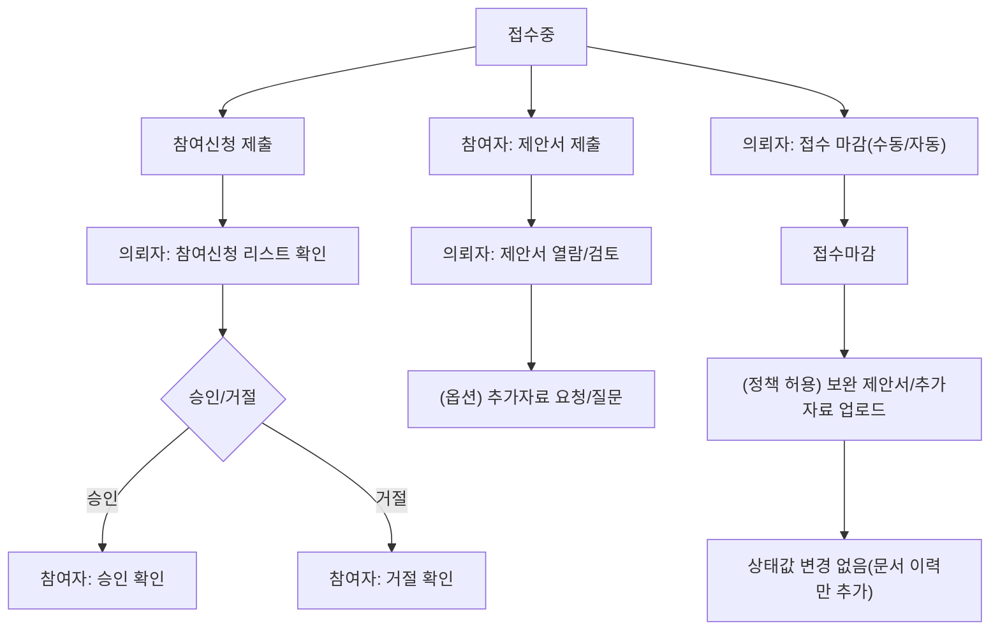

# 1) 접수/매칭 Flow (참여신청 vs 제안서)

---

## 1. 목적

프로젝트가 **접수중**일 때 참여자(제작사/대행사)가 **참여신청**과 **제안서 제출**을 수행하고, 의뢰자(광고주/대행사-의뢰)가 이를 **승인/거절·검토·마감**하는 전 과정을 표준화한다.

---

## 2. 핵심 개념

- **접수(Recruiting)**: 프로젝트가 지원을 받는 구간. `접수중 → 접수마감`으로 전이한다.
- **참여신청(Apply)**: 참여자가 “이 프로젝트에 참여하겠다”를 제출하는 신청 단위.
- **제안서(Proposal)**: 참여자가 실제 수행 계획/견적/구성 등을 문서로 제출하는 단위.
- **상세 제안서 보완(보완 제출)**: 접수마감 이후 또는 PT/계약 전후에도 추가 자료를 업로드할 수 있는 보완 제출(정책 허용 시).

---

## 3. 참여자 유형별 적용 범위

이 플로우는 아래 참여자에 공통 적용한다.

- **제작사(Participant)**
- **대행사(Participant)**

의뢰자는 아래 중 하나가 된다.

- **광고주(Owner)**
- **대행사(Owner: 광고주 대행)**

---

## 4. 프로젝트 유형별 접수 방식

### 4.1 공개 프로젝트(모집형)

- 누구나 프로젝트를 보고 **참여신청/제안서 제출**을 진행할 수 있다.
- 의뢰자는 접수중에 참여자를 선별(승인/거절)하고, 제안서를 검토한다.

### 4.2 비공개 직접의뢰(초대형)

- 의뢰자가 특정 파트너를 **초대**한 범위 내에서만 참여신청/제안서 제출이 가능하다.
- 접수 운영의 “동작”은 공개와 동일하되, **대상(노출/참여 가능자)**만 제한된다.

### 4.3 컨설턴트 의뢰(추천형)

- 추천/초대 구조로 참여자가 유입된다.
- 참여자 입장에서는 비공개 초대형과 유사하며, 제안서 제출/보완 제출의 규칙은 동일하게 적용한다.

---

## 5. 화면 구조(권장)

### 5.1 의뢰자(Owner) — 프로젝트 상세

- **참여신청 탭**: 지원사 리스트, 승인/거절, 질문/요청
- **제안서 탭**: 제안서 열람/다운로드, 비교(버전), 추가 자료 요청
- **접수 설정 탭**: 접수 마감(수동), 마감일/자동마감 확인

### 5.2 참여자(Participant) — 프로젝트 상세

- **참여신청**: 신청 작성/제출, 결과 확인
- **제안서**: 제안서 작성/업로드, 수정본 업로드, 보완 제출(허용 시)
- **커뮤니케이션**: 질문/답변, 추가 자료 요청 대응

---

## 6. 표준 Flow (Screen-by-Screen)

### 6.1 접수 오픈(접수중)

1. 의뢰자: 프로젝트 상태가 **접수중**으로 오픈됨
2. 참여자: 프로젝트 상세에서 `참여신청` 또는 `제안서 제출`을 시작

---

### 6.2 참여신청(Apply)

**참여자**

1. `참여신청` 클릭
2. 신청 정보 입력(간단 소개/핵심역량/연락 담당 등)
3. `제출`

**의뢰자**

1. 프로젝트 상세 > `참여신청 탭`
2. 지원사 프로필/역량 확인
3. `승인` 또는 `거절`
4. 필요 시 `질문/추가자료 요청`

**결과**

- 승인: 참여자는 제안서 제출 및 이후 단계 진행 가능
- 거절: 참여자는 참여 불가(정책에 따라 재신청 가능 여부 결정)

---

### 6.3 제안서 제출(Proposal)

**참여자**

1. `제안서 제출` 클릭
2. 제안서 업로드(파일/필드 입력/링크 등)
3. `제출 완료`

**의뢰자**

1. 프로젝트 상세 > `제안서 탭`
2. 제안서 열람/다운로드
3. 비교/검토
4. 필요 시 `추가자료 요청` 또는 `질문`

**수정(옵션)**

- 참여자는 접수중 상태에서 **수정본 재업로드** 가능(정책에 따라 횟수/기한 제한)

---

### 6.4 접수 마감(접수마감)

**의뢰자**

1. 프로젝트 상세 > `접수 설정 탭`
2. `접수 마감`(수동) 또는 마감일 도달(자동)
3. 상태: **접수마감**으로 전이

**효과(권장 규칙)**

- 접수마감 이후에는 원칙적으로 **신규 참여신청/신규 제안서 제출**을 제한
- 단, 아래 “보완 제출”은 정책에 따라 예외로 허용 가능

---

### 6.5 접수마감 이후 보완 제출(정책 허용 시)

접수마감 이후에도 아래 목적이라면 “보완 제안서/추가자료 업로드”를 허용할 수 있다.

- PT 전 보완
- PT 후 보완
- 계약 전 보완
- 계약 후 보완(추가 문서 제출)

**권장 접근 제어**

- 보완 제출은 **선정 후보/선정자** 또는 **의뢰자가 요청한 참여자**에게만 허용
- 업로드된 파일은 프로젝트 상태를 변경하지 않고 **문서 이력만 추가**

---

## 7. 버튼/권한 노출 규칙(권장)

### 7.1 참여자(Participant)

- `참여신청`: 접수중에서만 노출(비공개는 초대된 경우만)
- `제안서 제출`:
    - 접수중에서 노출
    - 접수마감 이후엔 원칙적으로 숨김
    - 다만 `보완 제출`은 의뢰자 요청이 있거나 정책 허용 시 노출
- `제안서 수정 업로드`: 접수중(또는 보완 제출 허용 기간)에서만 노출

### 7.2 의뢰자(Owner)

- `참여신청 승인/거절`: 접수중에서만 활성
- `접수 마감`: 접수중에서만 활성
- `추가자료 요청/질문`: 접수중~선정 전 구간에서 주로 활성(정책에 따라 계약 전까지 허용 가능)

---

## 8. 예외/정책 분기 체크리스트

운영/개발에서 반드시 결정해야 하는 항목(체크박스처럼 쓰면 됨)

- [ ]  참여신청 “승인 없이도” 제안서 제출을 허용할 것인가?
- [ ]  참여신청 거절 후 재신청을 허용할 것인가?
- [ ]  제안서 수정 업로드를 몇 회까지 허용할 것인가?
- [ ]  접수마감 이후 보완 제출을 허용할 것인가? (허용 대상: 후보/선정자/요청자 한정)
- [ ]  접수마감 이후 신규 제안서 제출을 전면 금지할 것인가?

---

## 9. Mermaid (세로형, 한글)

