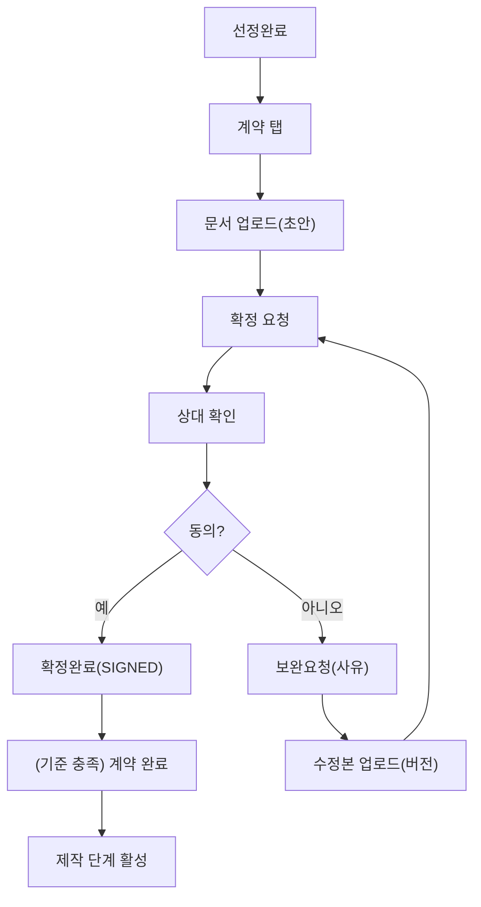

# 2) 계약/서류 업로드·확정 Flow

## 1. 목적

프로젝트에서 **선정 이후 계약 단계**로 진입했을 때, 계약서/서약서 등 **서류를 업로드하고 상호 확정**하는 과정을 표준화한다.

또한 **수정·재업로드(버전) / 확정 전후 권한 변화 / 예외(반려·보완)**를 명확히 정의한다.

---

## 2. 적용 범위

- **의뢰자(Owner)**: 광고주 / 대행사(광고주 대행)
- **참여자(Participant)**: 제작사 / 대행사(참여)
- **플랫폼 운영자(Operator)**: 분쟁/중단/예외 검토 시 개입(옵션)

---

## 3. 계약 단계 진입 조건(Entry)

아래 조건 중 하나를 만족하면 계약 플로우를 시작한다.

- 의뢰자가 **선정완료(SELECTED)** 처리
- 프로젝트 상태가 **계약(CONTRACT)** 단계로 전환(자동/수동 정책에 따라)

---

## 4. 서류 유형(권장 분류)

계약 탭에서 “문서 유형”을 구분해두면 운영이 쉬워진다.

- **계약서(Contract)**: 본계약/용역계약/발주서 등
- **보안서약서(NDA)**: 보안·기밀 관련
- **부속합의서(Addendum)**: 범위/일정/금액 변경 합의
- **증빙(Proof)**: 사업자등록증, 통장사본 등(필요 시)

---

## 5. 화면 구조(권장)

### 5.1 프로젝트 상세 > 계약(Contract) 탭

- 문서 리스트(유형/버전/업로더/업로드일/상태)
- 액션 버튼
    - `문서 업로드`
    - `확정 요청`
    - `확정(동의)`
    - `반려/보완 요청`
    - `버전 비교/다운로드`
- 상태 배지(권장)
    - `초안(DRAFT_DOC)`
    - `확정요청(SIGN_REQUESTED)`
    - `확정완료(SIGNED)`
    - `보완요청(REVISION_REQUESTED)`

---

## 6. 표준 Flow (Screen-by-Screen)

### 6.1 계약 문서 업로드

**A) 의뢰자 업로드 시작(일반적)**

1. 의뢰자: 프로젝트 상세 > 계약 탭
2. `문서 업로드` → 계약서/서약서 파일 업로드
3. 문서 상태: `초안(DRAFT_DOC)`
4. (옵션) `확정 요청` 클릭 → 상대방 확인 단계로 이동

**B) 참여자 업로드 시작(가능한 정책)**

- 참여자가 표준 계약서를 먼저 업로드하고 의뢰자가 확인하는 방식도 허용 가능
- 이후 흐름은 동일

---

### 6.2 확정 요청(서명/동의 요청)

1. 업로드한 쪽(의뢰자 또는 참여자)이 `확정 요청`
2. 문서 상태: `확정요청(SIGN_REQUESTED)`
3. 상대방에게 알림/딥링크(계약 탭) 발송

---

### 6.3 상대 확인(동의/반려)

**상대방 화면**

1. 프로젝트 상세 > 계약 탭 진입
2. 문서 열람/다운로드
3. 선택:
    - `확정(동의)`
    - `반려/보완 요청`(사유 입력)

**결과**

- 동의 시: `확정완료(SIGNED)`
- 반려 시: `보완요청(REVISION_REQUESTED)`로 전환 → 업로더에게 수정 요구

---

### 6.4 보완/재업로드(버전 관리)

1. 업로더가 보완 요청 사유 확인
2. `수정본 업로드`(같은 문서 유형에 버전 추가)
3. 새 버전 상태: `초안(DRAFT_DOC)` 또는 즉시 `확정요청(SIGN_REQUESTED)`
4. 다시 **확정 요청 → 동의/반려** 반복

> 권장: “기존 버전 삭제 금지”, 최신 버전을 상단 고정 + 이전 버전 다운로드 가능.
> 

---

### 6.5 계약 확정 완료(계약 단계 종료 조건)

아래 중 하나를 정책으로 선택해 종료 기준을 고정한다.

**옵션 1) 핵심 문서 1개 확정 시 계약 완료**

- 예: 계약서 1개가 `SIGNED`면 계약 완료

**옵션 2) 필수 문서 세트 확정 시 계약 완료(권장)**

- 예: `계약서 + NDA` 둘 다 `SIGNED`일 때 계약 완료

계약 완료 시:

- 프로젝트 진행 단계(제작)로 이동 가능
- 제작 관련 버튼/권한 활성화(예: 산출물 업로드 허용)

---

## 7. 권한/버튼 노출 규칙(권장)

### 7.1 문서 업로드 권한

- 기본: 의뢰자/선정된 참여자만 업로드 가능
- 미선정/비참여자는 접근 불가

### 7.2 상태별 버튼

- `초안(DRAFT_DOC)`
    - 업로더: 수정 업로드 가능, 확정 요청 가능
    - 상대방: 열람만 가능
- `확정요청(SIGN_REQUESTED)`
    - 업로더: 요청 취소(정책) 또는 수정 업로드(정책)
    - 상대방: 확정(동의) / 반려(보완 요청)
- `보완요청(REVISION_REQUESTED)`
    - 업로더: 수정본 업로드 + 재요청
    - 상대방: 대기
- `확정완료(SIGNED)`
    - 양측: 열람/다운로드만(수정은 부속합의서로 처리 권장)

---

## 8. 예외/정책 분기(필수 결정)

- [ ]  확정 요청 중에도 업로더가 문서를 교체(재업로드)할 수 있는가?
- [ ]  반려 시 사유 입력을 필수로 할 것인가?
- [ ]  확정 완료 후 변경은 “부속합의서(Addendum)”로만 허용할 것인가?
- [ ]  계약 확정 완료 기준은 1개 문서인가, 필수 문서 세트인가?
- [ ]  운영자가 계약 문서에 개입(강제 확정/무효화)할 수 있는가? (분쟁/중단 시)

---

## 9. 텍스트 순서도(복붙용)

```
[선정완료]
  |
  v
[계약 탭 진입]
  |
  v
[문서 업로드(계약서/서약서)]
  |
  v
[확정 요청]
  |
  v
[상대 확인]
  |
  +--> (동의) --------------> [확정완료(SIGNED)]
  |
  +--> (반려/보완요청) -----> [보완요청]
                                 |
                                 v
                           [수정본 업로드(버전)]
                                 |
                                 v
                            [확정 요청] (반복)

(종료 기준)
- 핵심 문서(또는 필수 문서 세트) SIGNED → 계약 완료 → 제작 단계 활성

```

---

## 10. Mermaid (세로형, 한글)

