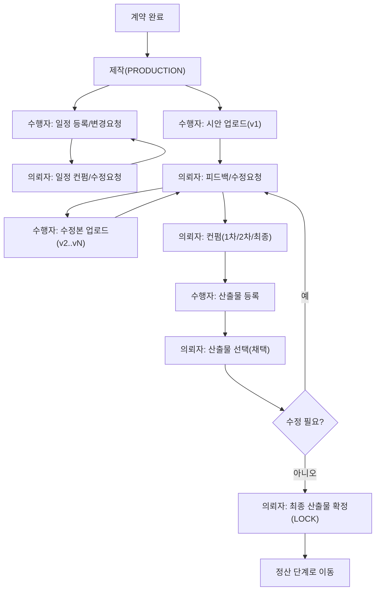

# 3) 제작 피드백 루프 + 산출물 확정 Flow

## 1. 목적

계약 확정 이후 **제작 진행(Production)** 동안 발생하는

- 일정/마일스톤 관리
- 시안(버전) 업로드 ↔ 피드백/수정 요청 반복(루프)
- 최종 컨펌
- 산출물(Deliverables) 등록/선택/최종 확정
    
    을 표준화한다.
    

---

## 2. 적용 범위

- **의뢰자(Owner)**: 광고주 / 대행사(의뢰)
- **수행자(Participant)**: 제작사 / 대행사(참여)
- **플랫폼 운영자(Operator)**: 중단/분쟁/예외 처리 시 개입(옵션)

---

## 3. 화면 구조(권장)

프로젝트 상세 내 탭 3개를 고정하면 흐름이 안정적이다.

1. **제작/일정 탭**
- 간트/마일스톤(촬영/후반/1차 시안/2차 시안/최종 등)
- 일정 등록/변경 요청/컨펌
- 변경 이력
1. **시안/피드백 탭**
- 시안 업로드(버전)
- 코멘트/수정요청/파일 첨부
- 컨펌 단계(1차/2차/최종) 상태 표시
1. **산출물 탭**
- 산출물(회차/버전) 리스트
- “선택(채택)”/“최종 확정”
- 확정 이후 다운로드/아카이빙

---

## 4. 제작 단계 표준 상태(권장)

프로젝트가 제작 단계에 들어오면 최소 아래 “구간”만 표시해도 충분하다.

- `제작 진행(PRODUCTION)`
- (세부 단계는 탭 내부에서 운영: 촬영/후반/시안1/시안2/최종 등)

---

# A) 제작 일정(간트/마일스톤) Flow

## A-1. 일정 등록/변경

**수행자(제작사/대행사 참여)**

1. 제작/일정 탭에서 마일스톤 날짜 입력
2. `일정 등록` 또는 `일정 변경 요청`

**의뢰자(광고주/대행사 의뢰)**

1. 알림/딥링크로 제작/일정 탭 진입
2. `컨펌(승인)` 또는 `수정 요청`

## A-2. 권장 규칙

- 일정은 “등록 즉시 반영”이 아니라 **컨펌 기반**이 안전하다.
- 변경은 모두 이력으로 남긴다(누가/언제/무엇을).

---

# B) 시안 업로드 ↔ 피드백 루프 Flow (핵심)

## B-1. 1회 루프(표준)

**수행자**

1. 시안/피드백 탭에서 `시안 업로드`
2. 시안 버전이 생성됨(예: v1)

**의뢰자**

3) 시안 열람 후 선택:

- `피드백/수정요청`
- `컨펌(승인)` (단계별 컨펌)

**수행자**

4) 수정 반영 후 `수정본 업로드` (v2, v3 …)

→ 위 과정을 **최종 컨펌까지 반복**

## B-2. 컨펌 단계(권장)

- `1차 컨펌` → `2차 컨펌` → `최종 컨펌`
- 각 단계는 “완료”로 찍히면 되돌리기 어렵게(정책) 하거나, 되돌리더라도 이력을 남긴다.

## B-3. 시안 버전 관리 규칙(권장)

- 삭제 금지, 버전만 누적
- “현재 유효 버전” 1개를 상단 고정
- 의뢰자 피드백은 “버전 단위로” 귀속(어느 버전에 대한 코멘트인지)

---

# C) 산출물 확정 Flow

## C-1. 산출물 등록(수행자)

1. 산출물 탭에서 `산출물 등록`
2. 항목 예:
    - 회차(1차/2차/최종)
    - 포맷/파일/링크
    - 설명/사용 범위 메모

## C-2. 산출물 선택(의뢰자)

1. 의뢰자는 산출물 탭에서 등록된 리스트 확인
2. `선택(채택)` 버튼으로 해당 산출물을 채택
3. 필요 시 `수정 요청`으로 다시 제작 루프로 회귀

## C-3. 최종 산출물 확정(의뢰자)

1. 최종본이 준비되면 `최종 확정`
2. 확정 이후:
    - 산출물 수정은 원칙적으로 제한
    - 변경이 필요하면 “추가 합의(부속합의서) + 신규 산출물 버전” 방식 권장

---

## C-4. “제작 ↔ 산출물” 연결 규칙(권장)

- 산출물 “선택(채택)” 전에라도 시안 루프는 계속될 수 있다.
- 최종 확정 이전까지는 산출물 재등록/교체 가능(이력 유지)
- 최종 확정 이후는 **락(Lock)**: 추가 변경은 예외 처리로만 가능

---

## 5. 버튼/권한 노출 규칙(권장)

### 5.1 수행자(제작사/참여자)

- `일정 등록/변경 요청`: 제작 단계에서 활성
- `시안 업로드/수정본 업로드`: 제작 단계에서 활성
- `산출물 등록`: 제작 단계에서 활성(또는 최종 컨펌 이후만 허용하는 정책도 가능)

### 5.2 의뢰자(광고주/의뢰자)

- `일정 컨펌/수정 요청`: 제작 단계에서 활성
- `피드백/수정 요청`: 제작 단계에서 활성
- `컨펌(1차/2차/최종)`: 단계별로 활성
- `산출물 선택/최종 확정`: 산출물 등록 이후 활성

---

## 6. 예외/정책 분기(필수 결정)

- [ ]  산출물 등록은 “최종 컨펌 이후”만 허용할 것인가, “제작 중에도” 허용할 것인가?
- [ ]  최종 확정 후 변경 요청이 오면 어떤 절차로 처리할 것인가? (부속합의서/예외 승인)
- [ ]  컨펌 단계를 1~3단계로 고정할 것인가, 프로젝트마다 설정 가능하게 할 것인가?
- [ ]  피드백 SLA(응답 기한)나 자동 리마인드를 둘 것인가?

---

## 7. 텍스트 순서도(복붙용)

```
[계약 완료 → 제작(PRODUCTION)]
  |
  v
(일정)
[수행자: 일정 등록/변경요청] -> [의뢰자: 컨펌/수정요청] -> (이력 누적)
  |
  v
(시안 루프)
[수행자: 시안 업로드(v1)]
  |
  v
[의뢰자: 피드백/수정요청] -----> [수행자: 수정본 업로드(v2)] -----> (반복)
  |
  +--> [의뢰자: 컨펌(1차/2차/최종)]
                |
                v
(산출물)
[수행자: 산출물 등록(1차/2차/최종)]
  |
  v
[의뢰자: 산출물 선택(채택)]
  |
  +--> (수정 필요) -> 시안 루프로 회귀
  |
  v
[의뢰자: 최종 산출물 확정(LOCK)]
  |
  v
[정산 단계로 이동]

```

---

## 8. Mermaid (세로형, 한글)

