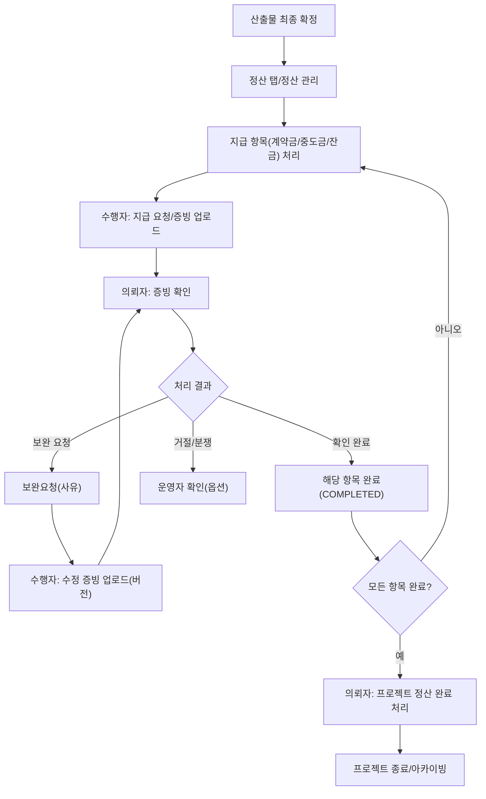

# 4) 정산(계약금/중도금/잔금 + 증빙 + 정산완료) Flow

## 1. 목적

프로젝트 제작/산출물 확정 이후 발생하는 **대금 지급 상태 관리**와 **증빙 업로드/확인**, **정산완료 확정**까지의 흐름을 표준화한다.

또한 **누가 어떤 버튼을 누르는지**, **거절/보완/예외(계좌오류·증빙누락 등)**를 명확히 정의한다.

---

## 2. 적용 범위

- **의뢰자(Owner)**: 광고주 / 대행사(의뢰)
- **수행자(Participant)**: 제작사 / 대행사(참여)
- **플랫폼 운영자(Operator)**: 분쟁/중단/예외 처리 시 개입(옵션)

---

## 3. 정산 구성 요소

### 3.1 지급 항목(권장 기본)

- **계약금(Deposit)**
- **중도금(Milestone Payment)**
- **잔금(Balance)**

> 프로젝트별로 “중도금 횟수”가 늘어날 수 있으면, 중도금1/2/3... 형태로 확장 가능.
> 

### 3.2 증빙(권장)

- **세금계산서/인보이스**
- **영수증/입금확인증(필요 시)**
- **기타 증빙(정산 요청서 등)**

---

## 4. 화면 구조(권장)

### 4.1 Work > 정산 관리(리스트)

- 프로젝트별 정산 상태 요약(계약금/중도금/잔금 진행률)
- `정산 상세`로 진입

### 4.2 프로젝트 상세 > 정산 탭

- 지급 항목별 카드(계약금/중도금/잔금)
    - 금액 / 예정일 / 지급 상태 / 증빙 업로드 상태
    - 액션 버튼
- 증빙 파일함(버전/업로더/업로드일)
- 정산 완료 처리 영역

---

## 5. 정산 상태(권장)

지급 항목(계약금/중도금/잔금) 각각에 상태를 둔다.

- `대기(PENDING)` : 아직 요청/진행 전
- `요청됨(REQUESTED)` : 지급(또는 증빙)이 요청됨
- `확인중(CHECKING)` : 증빙 확인 중
- `완료(COMPLETED)` : 해당 지급 항목 정리 완료
- `보완요청(REVISION_REQUESTED)` : 증빙/정보 보완 필요
- `거절(REJECTED)` : 정산 처리 불가(정책 사유)

---

# A) 지급 항목별 표준 Flow (계약금/중도금/잔금 공통)

## A-1. 정산 요청(트리거)

정산 요청은 아래 중 하나로 시작한다(정책 선택).

- 수행자(제작사)가 `지급 요청`을 누른다
- 의뢰자(광고주)가 `지급 등록/체크`를 진행한다
- 일정/마일스톤 도달 시 자동으로 `요청됨` 전환(옵션)

## A-2. 지급 처리 + 증빙 업로드

**수행자(권장 역할)**

1. 정산 탭에서 해당 항목(예: 계약금) 카드 진입
2. `증빙 업로드`(세금계산서/인보이스 등)
3. 상태: `확인중(CHECKING)` 또는 `요청됨(REQUESTED)`

**의뢰자(권장 역할)**

4) 증빙 확인 후 선택:

- `확인 완료`(해당 항목을 `완료(COMPLETED)` 처리)
- `보완 요청`(사유 입력) → `보완요청(REVISION_REQUESTED)`

## A-3. 보완 루프

**수행자**

1. 보완 사유 확인
2. 수정 증빙 업로드(버전 추가)
3. 다시 의뢰자 확인으로 회귀

---

# B) “정산 완료” 처리(프로젝트 단위 종료 기준)

## B-1. 프로젝트 정산완료 조건(권장)

아래 조건을 만족할 때 프로젝트 정산완료로 확정한다.

- 계약금/중도금/잔금 **모든 지급 항목이 COMPLETED**
- 필수 증빙 업로드가 완료(정책 기준)

## B-2. 정산완료 확정 버튼

- `정산 완료 처리`는 **의뢰자(광고주/의뢰자)**가 최종 확정하는 구조가 일반적으로 안전하다.
- 수행자는 `정산 완료 요청`까지만 가능하게 두는 방식이 충돌이 적다.

---

# C) 예외/거절 사유(권장 표준)

정산 항목의 `거절(REJECTED)` 또는 보완 사유로 자주 쓰는 케이스를 최소 세트로 둔다.

- **증빙 누락/형식 오류**
- **계좌 정보 오류**
- **활동 부적절/정책 위반(운영자 확인 필요)**
- **금액 불일치(계약/합의서 재확인 필요)**

> 거절은 강한 상태라 “운영자 확인 후 처리”로 잠그는 것도 권장.
> 

---

## 6. 버튼/권한 노출 규칙(권장)

### 6.1 수행자(제작사/참여자)

- `지급 요청` : 활성(정책 선택)
- `증빙 업로드/수정 업로드` : 활성
- `정산 완료 요청` : 마지막 단계에서만 활성(옵션)

### 6.2 의뢰자(광고주/의뢰자)

- `입금 체크/지급 완료 처리` : 각 항목별 활성
- `보완 요청/거절` : 증빙 검토 단계에서 활성
- `프로젝트 정산 완료 처리` : 모든 항목 완료 시 활성

### 6.3 운영자(옵션)

- 분쟁/중단/거절 확정 시 `강제 상태 변경` 권한(정책에 따라)

---

## 7. 텍스트 순서도(복붙용)

```
[산출물 최종 확정]
  |
  v
[정산 탭/정산 관리]
  |
  v
(각 지급 항목 반복: 계약금/중도금/잔금)
[수행자: 증빙 업로드 또는 지급 요청]
  |
  v
[의뢰자: 증빙 확인]
  |
  +--> (확인 완료) ------> [해당 항목 완료(COMPLETED)]
  |
  +--> (보완 요청) ------> [보완요청] -> [수행자: 수정 증빙 업로드] -> (의뢰자 확인으로 복귀)
  |
  +--> (거절/분쟁) ------> [운영자 확인] -> (거절 또는 보완/재합의)

[모든 항목 COMPLETED]
  |
  v
[의뢰자: 프로젝트 정산 완료 처리]
  |
  v
[완료/사후관리/아카이빙]

```

---

## 8. Mermaid (세로형, 한글)



---

## 9. 정책 결정 체크리스트(필수)

- [ ]  지급 항목별 “요청 주체”는 누구인가? (수행자 요청 / 의뢰자 체크 / 자동)
- [ ]  증빙 필수 유형(세금계산서 등)은 무엇인가?
- [ ]  거절(REJECTED)은 운영자 승인 후에만 가능한가?
- [ ]  정산완료 확정 버튼은 의뢰자만 가능한가? (권장: 예)
- [ ]  중단/취소 시 정산 항목은 어떻게 정리되는가? (부분정산/잔여금 처리)