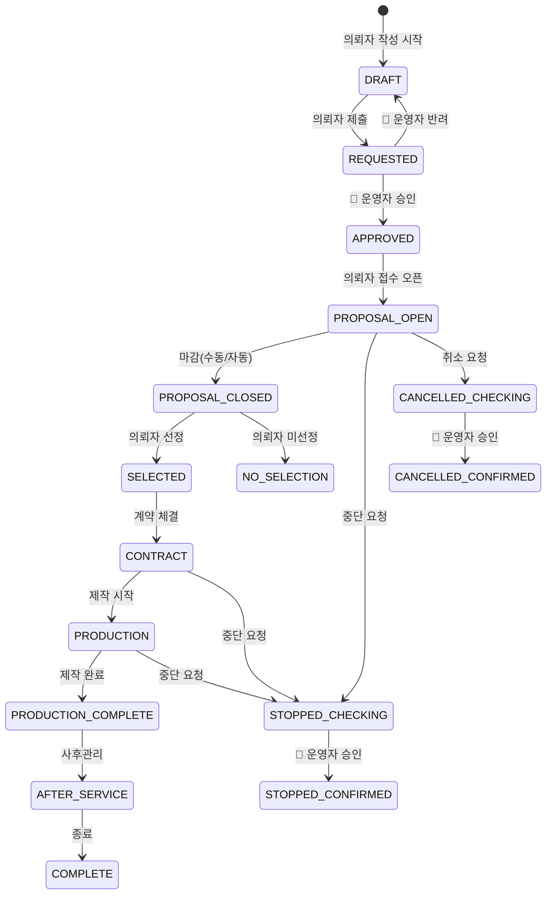
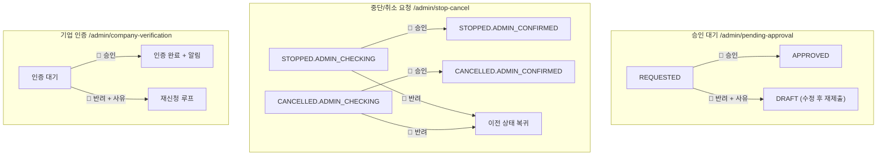

# Admin 상태 전이도 (State Machine)

문서 버전: 0.3-MVP | 최종 업데이트: 2026-04-02 | 작성자: JH Lee

---

## 1. 트리거 주체 범례

| 기호 | 의미 |
| --- | --- |
| 🔴 **ADMIN** | 플랫폼 운영자 액션으로만 전이 |
| 🔵 **OWNER** | 의뢰자(광고주·대행사) 액션으로 전이 |
| 🟢 **SYSTEM** | 일정 도달·자동화로 전이 (운영자 설정 가능) |
| 🟡 **BOTH** | 의뢰자 또는 운영자 둘 다 가능 |

---

## 2. 프로젝트 메인 상태 전이 (전체 흐름)

```
[DRAFT]
  │ 🔵 의뢰자 제출
  ▼
[REQUESTED] ──── 🔴 반려 ──────────────────────► [DRAFT] (수정 후 재제출)
  │
  │ 🔴 운영자 승인
  ▼
[APPROVED]
  │ 🔵 의뢰자 접수 오픈 (또는 🟢 자동)
  ▼
[PROPOSAL_OPEN]
  │ 🔵 의뢰자 수동 마감 / 🟢 마감일 도달
  ▼
[PROPOSAL_CLOSED]
  │
  ├── (OT 있음) ──► [OT_SCHEDULED] ──► [OT_COMPLETED] ──┐
  ├── (PT 있음) ──────────────────────► [PT_SCHEDULED] ──┤
  └── (없음) ──────────────────────────────────────────► ┘
                                                          │
                                              🔵 의뢰자 선정 처리
                                                    ▼
                                              [SELECTED]
                                                    │
                                   ┌────────────────┤
                                   │  미선정 참여사  │
                                   ▼                │
                            [NO_SELECTION]          │ 🔵 계약 진행
                            (참여사 단위)            ▼
                                              [CONTRACT]
                                                    │ 🔵 제작 시작
                                                    ▼
                                              [PRODUCTION]
                                           (세부: SHOOTING / EDITING /
                                            DRAFT_SUBMITTED / FINAL_APPROVED)
                                                    │ 🔵 제작 완료
                                                    ▼
                                         [PRODUCTION_COMPLETE]
                                                    │ 🟢 온에어
                                                    ▼
                                           [ONAIR_STARTED]
                                                    │ 🔵 사후관리 시작
                                                    ▼
                                           [AFTER_SERVICE]
                                                    │ 🔵 종료 처리
                                                    ▼
                                              [COMPLETE] ✅

━━━━━━━━━━━━━ 예외 경로 (어느 단계에서든 발생 가능) ━━━━━━━━━━━━━

[모든 진행 상태]
  │ 🔵 중단/취소 요청
  ▼
[STOPPED.ADMIN_CHECKING]  또는  [CANCELLED.ADMIN_CHECKING]
  │                                   │
  │ 🔴 운영자 승인                    │ 🔴 운영자 승인
  ▼                                   ▼
[STOPPED.ADMIN_CONFIRMED]    [CANCELLED.ADMIN_CONFIRMED]
```

---

## 3. 상태값 전체 목록 (코드 기준)

### 3-1. 프로젝트 메인 상태

| 상태명(한국어) | 코드 | 트리거 주체 | 어드민 관련 화면 |
| --- | --- | --- | --- |
| 임시저장 | `DRAFT` | 🔵 OWNER | — |
| 승인요청 | `REQUESTED` | 🔵 OWNER | 승인 대기 `/admin/pending-approval` |
| 승인완료 | `APPROVED` | 🔴 **ADMIN** | 승인 대기 |
| 승인반려 | `REJECTED` | 🔴 **ADMIN** | 승인 대기 |
| 접수중 | `PROPOSAL_OPEN` | 🔵 OWNER / 🟢 SYSTEM | 공고 프로젝트 |
| 접수마감 | `PROPOSAL_CLOSED` | 🔵 OWNER / 🟢 SYSTEM | 공고 프로젝트 |
| OT 예정 | `OT_SCHEDULED` | 🔵 OWNER | — |
| OT 완료 | `OT_COMPLETED` | 🔵 OWNER | — |
| 제안서 제출 대기 | `PROPOSAL_SUBMIT` | 🟢 SYSTEM | — |
| 제안서 제출 완료 | `PROPOSAL_SUBMITTED` | 🔵 참여사(PARTICIPANT) | — |
| PT 예정 | `PT_SCHEDULED` | 🔵 OWNER | — |
| PT 완료 | `PT_COMPLETED` | 🔵 OWNER | — |
| 미선정 | `NO_SELECTION` | 🔵 OWNER | — |
| 선정완료 | `SELECTED` | 🔵 OWNER | 전체 프로젝트 |
| 계약완료 | `CONTRACT` | 🔵 OWNER + PARTICIPANT | 계약 & 정산 |
| 촬영중 | `SHOOTING` | 🔵 PARTICIPANT | 진행 현황 |
| 후반작업 | `EDITING` | 🔵 PARTICIPANT | 진행 현황 |
| 시안제출 | `DRAFT_SUBMITTED` | 🔵 PARTICIPANT | 진행 현황 |
| 최종본 컨펌 | `FINAL_APPROVED` | 🔵 OWNER | 진행 현황 |
| 제작완료 | `PRODUCTION_COMPLETE` | 🔵 OWNER | 진행 현황 |
| 온에어 시작 | `ONAIR_STARTED` | 🟢 SYSTEM / 🔵 OWNER | — |
| 사후관리 | `AFTER_SERVICE` | 🔵 OWNER | — |
| 종료 | `COMPLETE` | 🔵 OWNER | 전체 프로젝트 |
| 중단 — 확인중 | `STOPPED.ADMIN_CHECKING` | 🔵 OWNER (요청) | 중단/취소 요청 |
| 중단 — 확정 | `STOPPED.ADMIN_CONFIRMED` | 🔴 **ADMIN** | 중단/취소 요청 |
| 취소 — 확인중 | `CANCELLED.ADMIN_CHECKING` | 🔵 OWNER (요청) | 중단/취소 요청 |
| 취소 — 확정 | `CANCELLED.ADMIN_CONFIRMED` | 🔴 **ADMIN** | 중단/취소 요청 |

---

### 3-2. 노출 상태 (Visibility)

| 상태명 | 코드 | 설명 | 변경 주체 |
| --- | --- | --- | --- |
| 공개 | `PUBLIC` | 전체 회원 열람 가능 | 🔵 OWNER / 🔴 ADMIN |
| 비공개 | `PRIVATE` | 승인된 파트너만 열람 | 🔵 OWNER |
| 초대 전용 | `INVITE_ONLY` | 초대받은 기업만 참여 | 🔵 OWNER |
| 숨김 | `HIDDEN` | 운영자 및 내부 전용 | 🔴 **ADMIN** (신고 처리 시) |

---

### 3-3. 파트너 참여 상태 (Partner Engagement)

| 단계 | 상태명 | 코드 | 설명 |
| --- | --- | --- | --- |
| 참여신청 | 참여신청 | `APPLY` | 파트너가 직접 참여 요청 |
| 초대 | 초대됨 | `INVITED` | 특정 파트너 초대 발송 |
| OT | 참석확정 | `OT_ACCEPTED` | OT 참석 확정 |
| OT | 참석불가 | `OT_INVITED` | OT 초대 받았으나 불참 |
| OT | 미참석 | `OT_NOT_ATTENDED` | OT 불참 |
| OT | 참석완료 | `OT_ATTENDED` | OT 완료 |
| 제안서 | 제출대기 | `PROPOSAL_SUBMIT` | 제안서 작성 중 |
| 제안서 | 제출완료 | `PROPOSAL_SUBMITTED` | 제안서 제출 완료 |
| PT | 참석확정 | `PT_ACCEPTED` | PT 참석 확정 |
| PT | 참석불가 | `PT_INVITED` | PT 초대 받았으나 불참 |
| PT | 발표완료 | `PT_COMPLETED` | PT 발표 완료 |
| 계약 | 계약완료 | `CONTRACTED` | 계약 체결 완료 |
| 종료 | 완료됨 | `COMPLETE` | 참여사 기준 종료 |
| 종료 | 중단됨 | `STOPPED` | 중단 |
| 종료 | 취소됨 | `CANCELLED` | 취소 |

---

### 3-4. 제작 진행 상태 (Production)

| 상태명 | 코드 | 트리거 |
| --- | --- | --- |
| 기획 진행 중 | `PLANNING` | 🔵 PARTICIPANT |
| 프리프로덕션 | `PPM` | 🔵 PARTICIPANT |
| 촬영 중 | `SHOOTING` | 🔵 PARTICIPANT |
| 후반 작업 | `EDITING` | 🔵 PARTICIPANT |
| 최종 납품 | `DELIVERED` | 🔵 PARTICIPANT |

---

### 3-5. 정산 상태 (Payment)

| 상태명 | 코드 | 트리거 |
| --- | --- | --- |
| 미정산 | `NOT_STARTED` | — |
| 계약금 지급 | `DEPOSIT_PAID` | 🔵 OWNER 확인 |
| 중도금 지급 | `MID_PAID` | 🔵 OWNER 확인 |
| 잔금 지급 | `BALANCE_PAID` | 🔵 OWNER 확인 |
| 정산 완료 | `COMPLETE` | 🔵 OWNER |

---

## 4. 어드민이 직접 트리거하는 상태 전이 (핵심 정리)

| # | 어드민 액션 | 이전 상태 | 이후 상태 | 화면 |
| --- | --- | --- | --- | --- |
| 1 | 공개 프로젝트 **승인** | `REQUESTED` | `APPROVED` | `/admin/pending-approval` |
| 2 | 공개 프로젝트 **반려** | `REQUESTED` | `REJECTED` (→ DRAFT) | `/admin/pending-approval` |
| 3 | 중단 요청 **승인** | `STOPPED.ADMIN_CHECKING` | `STOPPED.ADMIN_CONFIRMED` | `/admin/stop-cancel` |
| 4 | 취소 요청 **승인** | `CANCELLED.ADMIN_CHECKING` | `CANCELLED.ADMIN_CONFIRMED` | `/admin/stop-cancel` |
| 5 | 중단/취소 요청 **반려** | `*.ADMIN_CHECKING` | 이전 진행 상태로 복귀 | `/admin/stop-cancel` |
| 6 | 노출 **숨김** 처리 | `PUBLIC` / `PRIVATE` | `HIDDEN` | 신고 관리, 전체 프로젝트 |
| 7 | 기업 인증 **승인** | 인증대기 | 인증완료 | `/admin/company-verification` |
| 8 | 기업 인증 **반려** | 인증대기 | 반려 (재신청 가능) | `/admin/company-verification` |

---

## 5. Mermaid 다이어그램

### 5-1. 프로젝트 메인 상태 전이 (어드민 관점)



### 5-2. 어드민 핵심 액션 플로우



---

## 6. 상태 전이 시 발생해야 하는 후속 처리

| 전이 | 후속 처리 | 담당 |
| --- | --- | --- |
| `REQUESTED → APPROVED` | 광고주에게 승인 알림 발송 | 🟢 SYSTEM |
| `REQUESTED → REJECTED` | 광고주에게 반려 사유 알림 발송 | 🟢 SYSTEM |
| `STOPPED.ADMIN_CHECKING → ADMIN_CONFIRMED` | 정산/증빙 정리 안내 발송 + 관련 참여사 알림 | 🟢 SYSTEM |
| `CANCELLED.ADMIN_CHECKING → ADMIN_CONFIRMED` | 동일 | 🟢 SYSTEM |
| 인증 승인 | 기업 인증 완료 상태 반영 + 알림 발송 | 🟢 SYSTEM |
| 인증 반려 | 반려 사유 알림 + 재신청 안내 | 🟢 SYSTEM |
| 노출 `HIDDEN` 처리 | 해당 콘텐츠 사용자 화면에서 숨김 | 🟢 SYSTEM |

---

## 7. 구현 현황

| 전이 | API 연동 | 비고 |
| --- | --- | --- |
| `REQUESTED → APPROVED/REJECTED` | ❌ 미연동 (UI만 존재) | MVP 1순위 |
| `ADMIN_CHECKING → ADMIN_CONFIRMED` | ❌ 미연동 | MVP 1순위 |
| 기업 인증 승인/반려 | ❌ 미연동 | MVP 2순위 |
| 노출 `HIDDEN` 처리 | ❌ 미연동 | 신고 처리 연계 |
| 리뷰 숨김/삭제 | ⚠️ 클라이언트 상태만 | MVP 2순위 |

---