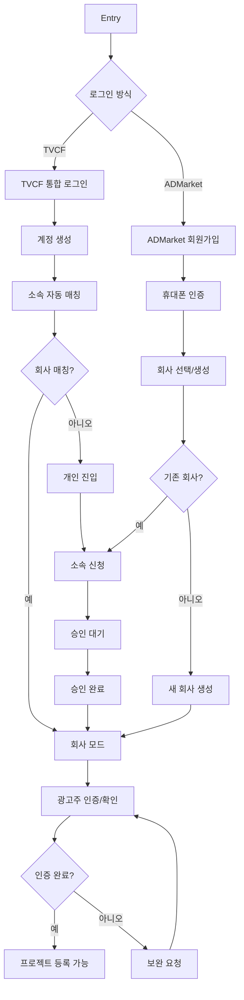
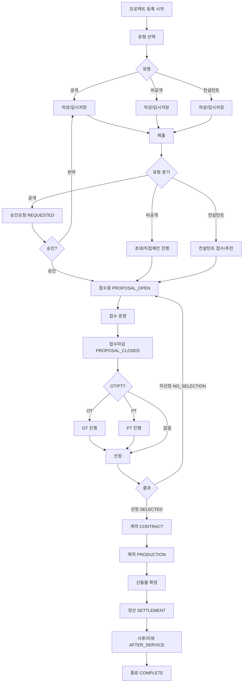

# 광고주 User Flow

## 0) 진입(Entry)

- **Home**
    - `프로젝트 의뢰하기` CTA
    - `로그인` 버튼
- **Work**
    - `내 프로젝트` 목록(진행중/완료/중단/취소)
- **알림/메시지**
    - “승인 결과 / 접수 / 제안서 / OT·PT / 선정 / 계약 / 산출물 / 정산” 딥링크

---

## 1) 로그인/가입(Access)

### 1-1. 화면: 로그인 방식 선택

- 버튼
    - `TVCF 통합 로그인`
    - `ADMarket 회원가입`

### 1-2A. 화면: TVCF 통합 로그인

- 결과: 최초 로그인 시 계정 생성 + **소속 자동 매칭 시도**
- 분기
    - 매칭 성공 → 회사 모드 진입
    - 매칭 실패 → 개인 진입 → `회사 선택/소속 신청` 유도

### 1-2B. 화면: ADMarket 회원가입

- 필수
    - 휴대폰 인증
    - 기본정보 입력
- 다음: `회사 선택 또는 새 회사 생성`

---

## 2) 회사 설정/권한 확정(Company / Role)

### 2-1. 화면: 회사 선택

- 분기
    - `기존 회사 선택` → 소속 신청(승인 대기)
    - `새 회사 생성` → 대표관리자 생성(회사 계정 생성)

### 2-2. 화면: 소속 신청(승인 대기)

- 상태: 승인 대기
- 승인 주체: 회사 대표관리자/부관리자(또는 운영 프로세스)
- 결과: 승인 완료 시 회사 모드 접근 가능

### 2-3. 화면: 회사 모드 진입(광고주)

- 상단 배지 예: `회사 모드 / 광고주`
- 가능한 메뉴: `프로젝트 등록`, `내 프로젝트`, `정산 관리`, `회사 정보`

---

## 3) 광고주 인증(Advertiser Verification)

> ADMarket은 “광고주 = 인증된 광고주” 전제가 있으니 이 단계가 선행.
> 

### 3-1. 화면: 광고주 인증 안내

- 내용: 인증 필요 사유 + 처리 방식(전화 확인/서류 확인 등)

### 3-2. 화면: 인증 정보 입력/제출

- 예시 입력:
    - 회사명/담당자/연락처
    - 사업자 정보(있다면)
    - 추가 확인용 메모

### 3-3. 결과 분기

- 인증 완료 → 프로젝트 등록 가능
- 보완 요청 → 보완 제출 → 재검토 루프

---

## 4) 프로젝트 등록(Project Creation)

### 4-1. 화면: 새 프로젝트 작성 시작

- 버튼: `새 프로젝트 작성`, `임시저장 불러오기`

### 4-2. 화면: 등록 유형 선택

- `공개 프로젝트(모집형)`
- `비공개 직접의뢰`
- `컨설턴트 의뢰`

### 4-3. 화면: 프로젝트 작성(단계형 폼)

- 주요 입력:
    - 프로젝트명 / 제품명·제품 종류 / 목적·매체·톤앤매너 / 예산 / 일정 / 제외 조건 / 제출자료 / 컨펌 프로세스 등
- 버튼:
    - `임시저장`
    - `제출`

### 4-4. 제출 후 상태

- 공개: `승인요청`(운영자 승인 대기)
- 비공개: 바로 초대/직접 제안 흐름
- 컨설턴트: 컨설턴트 접수로 이동

---

## 5) 승인(공개 프로젝트만)

### 5-1. 화면: 프로젝트 상세(승인대기)

- 상태: 승인요청
- 액션: 대기 / (정책상 허용되는 수정만)

### 5-2. 결과 분기

- 승인 → `접수중` 오픈
- 반려 → 반려 사유 확인 → 수정 → 재제출

---

## 6) 접수 운영(Apply + Proposal)

### 6-1. 화면: 프로젝트 상세 > 접수/지원 관리

광고주 핵심 작업 3개:

1. **참여신청 관리(승인/거절)**
2. **제안서 검토/비교**
3. **접수 마감(수동/자동)**

---

## 7) OT/PT 운영(선택)

### 7-1. 화면: 프로젝트 상세 > 일정(OT/PT)

- OT/PT 일정 등록/변경
- 참석 현황 확인
- PT 완료 처리

---

## 8) 선정(Selection)

### 8-1. 화면: 프로젝트 상세 > 선정

- 후보 비교
- **선정 결과 등록**
    - 선정완료 / 미선정

---

## 9) 계약(Contract)

### 9-1. 화면: 프로젝트 상세 > 계약

- 계약 조건 정리
- 계약서/서약서 업로드
- 확정 요청/확정 완료

---

## 10) 제작(Production)

### 10-1. 화면: 프로젝트 상세 > 제작/일정

- 일정 컨펌(간트/마일스톤)
- 제작 진행 체크

### 10-2. 화면: 프로젝트 상세 > 시안/피드백

- 시안 업로드 ↔ 피드백/수정 요청 반복

---

## 11) 산출물 확정(Deliverables)

### 11-1. 화면: 프로젝트 상세 > 산출물

- 회차/버전 확인
- **최종본 선택/확정**

---

## 12) 정산(Settlement)

### 12-1. 화면: 정산 관리 / 프로젝트 상세 > 정산

- 계약금/중도금/잔금 체크
- 증빙 확인
- 정산 완료 처리

---

## 13) 사후관리/리뷰 → 종료

### 13-1. 화면: 사후관리(KPI)

- KPI 등록/결과 입력

### 13-2. 화면: 리뷰

- 리뷰 등록

### 13-3. 종료

- 완료 + 자료 아카이빙

---

# 광고주 Flow





```mermaid
[Entry: Home/Work]
  |
  v
[로그인 방식 선택]
  |-----------------------------------|
  |                                   |
  v                                   v
[TVCF 통합 로그인]                    [ADMarket 회원가입]
  |                                   |
  v                                   v
[최초 로그인/계정 생성]               [휴대폰 인증/기본정보]
  |                                   |
  v                                   v
[소속 자동 매칭(TVCF 기업DB)]          [회사 선택 또는 새 회사 생성]
  |                                   |
  v                                   v
{회사 매칭됨?}                        {기존 회사?}
  |----예-------------------------> [회사 모드 진입]
  |
  +----아니오----> [개인 진입] -> [회사 선택/소속 신청] -> [승인 대기] -> [승인 완료] -> [회사 모드]

[회사 모드]
  |
  v
[광고주 인증/확인]
(전화 확인/서류 확인 등)
  |
  v
{인증 완료?}
  |----예----> [프로젝트 등록 가능]
  |
  +----아니오-> [보완 요청] -> [보완 제출] -> (재확인)

```

```mermaid
[프로젝트 등록 시작]
  |
  v
[등록 유형 선택]
  |-----------------------------|------------------------------|
  |                             |                              |
  v                             v                              v
[공개 프로젝트]                 [비공개 직접의뢰]              [컨설턴트 의뢰]
  |                             |                              |
  v                             v                              v
[작성(임시저장 가능)]            [작성(임시저장 가능)]           [작성(임시저장 가능)]
  |
  v
[제출]
  |
  v
(공개) [승인요청(REQUESTED)]  ----> {승인 결과}
           |                         |----(반려)--> [수정] -> [재제출] -> (승인요청)
           |                         |----(승인)--> [승인완료(APPROVED)] -> [접수중(PROPOSAL_OPEN)]
           |
(비공개) -------------------------------> [초대/직접 제안 기반 접수 운영]
(컨설턴트) -----------------------------> [컨설턴트 접수/추천 진행]

[접수중(PROPOSAL_OPEN)]
  |
  v
[접수 운영]
- 참여신청 승인/거절
- 제안서 열람/비교/질문
- 접수 마감(수동/자동)
  |
  v
[접수마감(PROPOSAL_CLOSED)]
  |
  v
{OT/PT 진행?}
  |------------|-------------|
  |            |             |
  v            v             v
[OT]         [PT]          [없음]
  \            |             /
   \           v            /
        [선정]
          |
          v
{결과 등록}
  |----------------------------|
  |                            |
  v                            v
[선정완료(SELECTED)]        [미선정(NO_SELECTION)]
  |                            |
  v                            +--> (정책에 따라) [재접수 또는 종료]
[계약(CONTRACT)]
- 계약서/서약서 업로드
- 확정 요청/확정
  |
  v
[제작(PRODUCTION)]
- 일정 컨펌(간트/마일스톤)
- 시안 업로드 ↔ 피드백/수정 반복
  |
  v
[산출물 확정(Deliverables)]
- 버전/회차 확인
- 최종본 선택/확정
  |
  v
[정산(Settlement)]
- 계약금/중도금/잔금
- 증빙 확인
- 정산 완료
  |
  v
[사후관리/리뷰(AFTER_SERVICE)]
- KPI 등록/결과 입력(선택)
- 리뷰 등록
  |
  v
[종료(COMPLETE)]

```