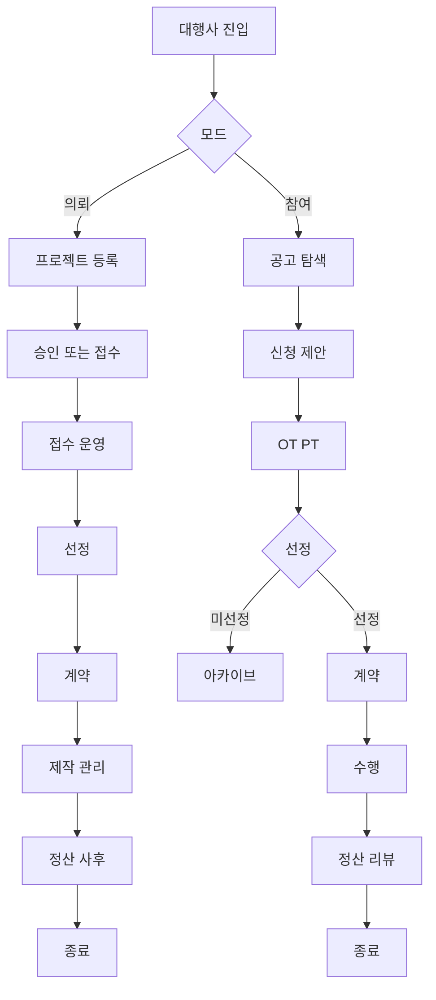

# 대행사 User Flow

## A. 대행사 의뢰 모드(광고주 대행)

> 광고주 대신 프로젝트를 만들고 운영하는 플로우
> 
1. **진입**
- Home/Work → `프로젝트 의뢰(대행)` 시작
1. **프로젝트 등록(대행 입력)**
- 광고주 정보(클라이언트 선택/등록)
- 프로젝트 정보 입력(예산/일정/목적/제외조건/제출자료)
- 임시저장/제출
1. **승인/접수(공개일 때)**
- (공개) 승인 요청 → 승인 완료 → 접수 오픈
- (비공개) 초대/직접 제안으로 진행
1. **접수 운영**
- 지원사/제안서 관리
- OT/PT 일정 운영
- 선정 결과 등록
1. **계약**
- 계약 조건 정리
- 계약서/서약서 업로드/확정 요청
- 상대 확정 확인
1. **제작 관리**
- 일정 컨펌(간트/마일스톤)
- 시안 피드백 정리/전달(광고주 ↔ 제작사 중간 역할)
- 최종본 확정 지원
1. **정산/사후관리**
- 정산 단계 체크(클라이언트 결제 확인)
- 증빙 확인
- KPI/리뷰 수집(또는 리마인드)

✅ 핵심: 이 플로우는 **광고주 플로우와 거의 동일**한데, “광고주 대신” 진행한다는 점만 다름.

---

## B. 대행사 참여 모드(프로젝트 수주)

> 공고에 참여해서 수주하고 수행하는 플로우 (제작사 플로우와 유사)
> 
1. **프로젝트 탐색**
- 프로젝트 공고 리스트 → 필터/검색 → 상세
1. **참여 신청/제안서 제출**
- 참여 신청
- 제안서/견적/포트폴리오 제출
1. **OT/PT 대응**
- OT/PT 참석 확정
- 발표/추가자료 제출
1. **선정 결과**
- 선정됨 → 계약 단계
- 미선정 → 종료/아카이브
1. **계약**
- 계약 조건 확인/수정요청
- 서류 업로드/확정
1. **수행(제작/관리)**
- 일정 등록/진행
- 산출물 업로드
- 피드백 반영
1. **정산/리뷰**
- 증빙 업로드
- 정산 완료 확인
- 리뷰 등록

✅ 핵심: 참여 모드는 **제작사 플로우랑 거의 동일**.

---

# “가장 중요한 연결점” (대행사만 있는 특이 케이스)

## C. 대행사가 참여로 수주한 뒤, 제작사를 구성하는 경우(하이브리드)

이 케이스가 ADMarket에서 제일 헷갈리는데, 플로우를 따로 잡아야 해.

**참여 모드로 선정됨**

→ 계약 완료

→ (대행사 내부에서) **제작사 구성 시작**

- 내부/외부 제작사 섭외(파트너스 검색/초대)
- 제작사와 별도 계약/정산(플랫폼에서 다룰지 여부 정책 결정)
- 프로젝트 수행/산출물/정산

👉 여기서 선택지는 2개야:

- **옵션1(단순)**: 플랫폼은 “대행사=단일 수행자”로만 보고, 제작사 구성은 대행사 내부 프로세스(플랫폼 밖)
- **옵션2(확장)**: 플랫폼에서 “하위 참여자(제작사)”를 초대해 프로젝트에 참여시키는 구조(권한/정산/산출물 복잡해짐)

Kitty가 예전에 말한 방향은 보통 **옵션1로 먼저 가고**, 나중에 옵션2로 확장하는 게 안정적이야.

---

## Mermaid

