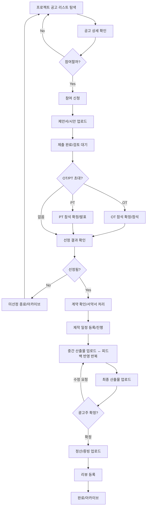

# 제작사 User Flow

## A. 진입 경로 (Entry Points)

1. **프로젝트 공고(Project List)**
- 필터/검색 → 관심 프로젝트 발견 → 상세 진입
1. **알림(Notification)**
- “OT/PT 초대”, “선정/미선정”, “계약 확정 요청”, “수정 요청”, “정산 확인” 등 → 해당 프로젝트 상세로 딥링크
1. **쪽지/메시지(Messages)**
- 광고주 문의/요청 → 대화에서 프로젝트 상세로 이동

---

# 1) 프로젝트 탐색 (Discover)

## 1-1. 화면: 프로젝트 공고 리스트

- 행동
    - 검색/필터(예산, 업종, 매체, 일정, 목적, 제작기법 등)
    - `즐겨찾기`(스크랩)
    - `문의 메시지`(가능하면)

## 1-2. 화면: 프로젝트 공고 상세

- 확인
    - 프로젝트 요약(목적/예산/일정/요구자료/참여조건/제외조건)
- 행동
    - `참여 신청`(또는 `제안서 제출`)
    - `문의` / `쪽지`
    - `즐겨찾기`

---

# 2) 참여 신청 / 제안 (Apply & Proposal)

## 2-1. 화면: 참여 신청(Apply)

- 입력/선택
    - 기본 참여 정보(담당자, 연락처)
    - 참여 의사/가능 일정
    - 경쟁사 여부 체크(제외 조건 충족 여부)
- 버튼
    - `신청 제출`
    - `임시저장`(있다면)

## 2-2. 화면: 제안서 등록(Proposal Submit)

- 업로드/작성
    - 전략 제안서 / 크리에이티브 제안서
    - 시안 영상(가능하면)
    - 회사소개서/포트폴리오(자동/선택 첨부)
- 버튼
    - `제안서 제출`
    - `수정/재업로드`(마감 전)

## 2-3. 화면: 제출 완료(제안 현황)

- 표시
    - 제출 상태(제출완료/검토중/추가요청 등)
    - 마감일까지 수정 가능 여부
- 행동
    - `제안서 수정`
    - `문의/쪽지`

---

# 3) OT / PT 응대 (선택 단계)

## 3-1. 화면: 프로젝트 상세 > 일정/OT

- 광고주가 OT를 열면
    - `OT 안내 확인`
    - `참석 확정/불참`
    - (필요 시) 질문/자료 요청

## 3-2. 화면: 프로젝트 상세 > 일정/PT

- 광고주가 PT를 열면
    - `PT 안내 확인`
    - `참석 확정/불참`
    - PT 준비 자료 업데이트(제안서 보강/시안 추가)

---

# 4) 선정 결과 (Selected / Not Selected)

## 4-1. 화면: 알림/프로젝트 상세 > 선정 결과

- 분기
    - **선정됨** → 계약 단계로 이동
    - **미선정** → 결과 확인 후 종료(또는 다음 공고 탐색)
- 행동
    - (선정됨) `계약 진행` 버튼
    - (미선정) `피드백 요청`(가능하면), `아카이브`

---

# 5) 계약 (Contract)

## 5-1. 화면: 계약 정보 확인(Participant)

- 광고주가 올린 계약 정보/파일 확인
- 행동
    - `확인` / `수정 요청`(필요 시)
    - `계약 확정`(또는 “확정 동의”)

## 5-2. 화면: 계약 파일/서약서 업로드(필요 시)

- 업로드
    - 서명된 계약서, 보안서약서, 기타 첨부
- 완료 처리
    - 계약 확정 이후 제작 단계로 이동

---

# 6) 제작 진행 (Production)

## 6-1. 화면: 프로젝트 상세(제작) > 일정(간트/마일스톤)

- 행동
    - 제작 일정 등록/수정
    - 주요 마일스톤 업데이트(촬영/편집/시안/최종)

## 6-2. 화면: 프로젝트 상세(제작) > 커뮤니케이션

- 행동
    - 광고주 요청사항 확인
    - `쪽지/채팅`으로 질의응답
    - 회의록/자료 공유(파일함/첨부가 있으면 활용)

## 6-3. 화면: 산출물 업로드(중간본/시안)

- 업로드
    - 1차/2차/3차 시안(버전 관리)
- 광고주 피드백 수신
    - `수정 요청 확인` → 반영 → 재업로드 반복

---

# 7) 최종 산출물 (Final Deliverable)

## 7-1. 화면: 최종 산출물 업로드

- 업로드
    - 최종본(파일/링크/버전)
- 행동
    - `최종 확정 요청`(광고주 선택/확정 유도)

## 7-2. 화면: 확정 결과

- 분기
    - **확정됨** → 정산 단계로 이동
    - **수정 요청** → 수정 후 재업로드 루프

---

# 8) 정산 (Settlement) — 제작사 기준

## 8-1. 화면: 정산 관리(Participant)

- 확인
    - 계약금/중도금/잔금 진행 상태
    - 예정일/요청 상태

## 8-2. 화면: 증빙 업로드(영수증/세금계산서)

- 업로드
    - 세금계산서/영수증/정산 관련 파일
- 행동
    - `정산 완료 요청`(또는 지급 확인 요청)

---

# 9) 리뷰 / 후기 (Review)

## 9-1. 화면: 리뷰 등록

- 행동
    - 광고주에 대한 리뷰 작성
    - 프로젝트 회고/제작기(선택)

## 9-2. 화면: 종료/아카이브

- 프로젝트 완료 후
    - 자료 보관(계약서/산출물/정산 증빙)
    - 내 이력/포트폴리오 반영(가능하면)

---

# 예외 플로우 (제작사 관점)

## E1) 접수 전/후 철회

- 접수중일 때: `참여 취소`(가능 범위 내)
- 마감 후/선정 후: 취소 시 정책에 따른 제재/기록 가능(운영 정책에 따라)

## E2) 일정/범위 변경 이슈

- 광고주가 일정 변경 → 제작사는 `수용/불가` 응답
- 불가 시: 재협의 또는 중단/취소 흐름으로 이동

## E3) 프로젝트 중단/취소

- 광고주/운영 판단으로 중단/취소되면
    - 제작사는 정산/증빙 정리 후 종료 처리

---

# Mermaid (제작사 다이어그램용)

