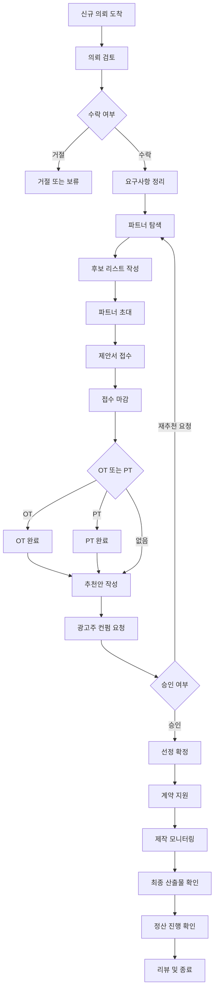

# 컨설턴트 User Flow

## A. 컨설턴트가 다루는 “의뢰 유형”

1. **컨설턴트 의뢰형 프로젝트(Advertiser → Consultant Request)**
- 광고주가 “컨설턴트에게 맡김”으로 등록
- 컨설턴트가 파트너 추천/초대/선정 진행을 주도
1. **컨설턴트 개입(일반 프로젝트에 컨설턴트가 붙는 경우)**
- 공개/비공개 프로젝트에 운영/광고주가 컨설턴트를 배정
- 이후는 동일 플로우(추천/선정/관리)
- 

---

## 1) 의뢰 접수 (Intake)

### 1-1. 화면: 컨설턴트 Work 홈(대시보드)

- 신규 의뢰 알림/리스트 확인
- 액션: `의뢰 열기`

### 1-2. 화면: 의뢰 상세(요약)

- 광고주가 작성한 정보 확인
    - 목적/예산/일정/매체/제외조건/필수요구/제출자료 등
- 액션:
    - `추가 질문 보내기`(메시지)
    - `요구사항 보완 요청`
    - `진행 수락`(또는 `반려/보류`)

### 1-3. 화면: 요구사항 확정(컨설턴트 편집)

- 컨설턴트가 “정리본”을 만듬
- 액션:
    - 모집 방식 확정(공개 모집/초대 모집/혼합)
    - PT/OT 여부 확정
    - 평가 기준(선정 기준) 등록
    - 일정 확정(접수 마감/OT/PT/납품/온에어)

---

## 2) 파트너 구성 (Sourcing)

### 2-1. 화면: 파트너 탐색(검색/필터)

- 액션:
    - 조건 필터(업종/예산/기법/매체/수상/포트폴리오 등)
    - 후보 리스트업(Shortlist)

### 2-2. 화면: 후보 리스트(Shortlist)

- 액션:
    - 후보를 “초대 대상”으로 담기
    - 경쟁사 제외 조건 체크
    - 후보별 코멘트/평가 메모 남기기

### 2-3. 화면: 초대 발송

- 액션:
    - `초대 메세지 발송`
    - `제안서 요청(마감일 포함)`
- 결과:
    - 후보 파트너에게 알림/메시지 발송
    - 프로젝트는 “접수 대기/접수중” 상태로 전환(운영 로직에 따라)

---

## 3) 제안/접수 운영 (Proposal Management)

### 3-1. 화면: 접수 현황

- 액션:
    - 제안서 제출 현황 확인(제출/미제출)
    - 미제출 대상 리마인드 발송
    - 광고주 질문/변경사항 전달(브리프 업데이트)

### 3-2. 화면: 제안서 리스트

- 액션:
    - 제안서 열람/다운로드
    - 비교(가격/일정/전략/크리에이티브/리스크)
    - 추가 질문/수정 요청(메시지)

### 3-3. 화면: 접수 마감

- 액션:
    - `접수 마감` 처리(또는 자동 마감)

---

## 4) OT / PT 운영 (선택)

### 4-1. 화면: OT 일정/초대

- 액션:
    - OT 일정 등록
    - OT 초대 발송
    - 참석 현황 체크

### 4-2. 화면: PT 일정/초대

- 액션:
    - PT 일정 등록
    - PT 초대 발송
    - PT 종료 처리(완료)

---

## 5) 추천안 작성 → 광고주 승인 (Key)

### 5-1. 화면: 추천안(Recommendation)

컨설턴트 플로우의 핵심.

- 액션:
    - 후보 2~5개 “추천안 카드” 생성
    - 추천 사유/리스크/비교표 작성
    - 1순위/2순위 제안

### 5-2. 화면: 광고주 컨펌 요청

- 액션:
    - `추천안 공유(컨펌 요청)` 보내기
    - 광고주 피드백 반영(수정 요청 반영)

### 5-3. 분기

- 광고주가 최종 선택
    - `선정 승인` → 선정 단계로 이동
- 광고주가 재추천 요청
    - 후보 추가/교체 → 2) 또는 3)으로 되돌아감

---

## 6) 선정 확정 (Selection)

### 6-1. 화면: 선정 처리

- 액션:
    - 최종 선정 파트너 확정
    - 나머지 파트너 결과 안내 발송(미선정)

---

## 7) 계약 단계 지원 (Contract Assist)

### 7-1. 화면: 계약 자료 체크

- 액션:
    - 계약 조건 정리(범위/일정/지급조건/산출물/저작권)
    - 계약서/서약서 업로드 가이드
    - 양측 확정 상태 확인

> 컨설턴트는 “서명 당사자”가 아니라, 정리/검수/진행관리 역할로 설계.
> 

---

## 8) 제작 진행 모니터링 (Production Monitoring)

### 8-1. 화면: 일정/진행 현황

- 액션:
    - 일정 업데이트 체크
    - 이슈 발생 시 조정(광고주 ↔ 제작사 커뮤니케이션 중재)

### 8-2. 화면: 시안/피드백 흐름 모니터링

- 액션:
    - 광고주 피드백 정리
    - 제작사 전달/반영 확인

---

## 9) 산출물/정산/리뷰 클로징 (Closing)

### 9-1. 화면: 산출물 확정 체크

- 액션:
    - 최종본 확정 여부 확인
    - 누락 산출물 체크리스트

### 9-2. 화면: 정산 체크

- 액션:
    - 지급 단계 진행 확인(증빙 포함)

### 9-3. 화면: 리뷰/종료

- 액션:
    - 광고주 리뷰 등록 리마인드
    - 프로젝트 종료 처리

---

# Mermaid (안 깨지는 버전)

