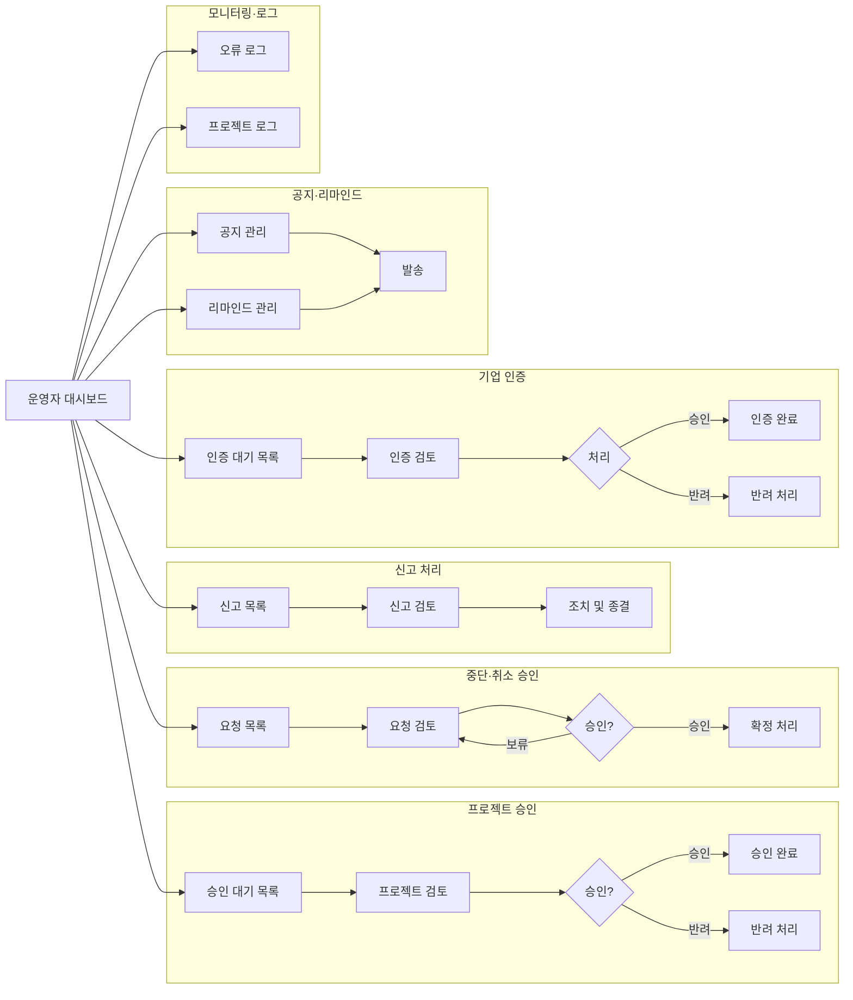

# 플랫폼 운영자 User Flow

## A. 진입 경로

1. **운영자 Admin 홈(대시보드)**
- 오늘의 To-do(승인대기 프로젝트 / 신고 / 기업 인증 / 오류 / 리마인드)
1. **알림(Notification)**
- “승인 대기”, “신고 발생”, “시스템 오류 로그” 등 운영자용 알림 클릭 → 해당 화면 딥링크

---

## 1) 공개 프로젝트 승인(핵심) — REQUESTED → APPROVED/REJECTED

> 공개 프로젝트는 운영자 승인 필요
> 

### 1-1. 화면: 승인 대기함(프로젝트)

- 리스트: 상태 `REQUESTED`(승인요청)
- 액션:
    - 프로젝트 클릭 → 상세 검토

### 1-2. 화면: 프로젝트 상세(운영자 검토)

- 체크 항목(예시)
    - 카테고리/예산/일정 값 유효성
    - 금지/민감 요소(정책 위반) 여부
    - 비공개/초대전용/공개 설정 적합성(노출 상태)
- 액션 버튼:
    - `승인(APPROVED)`
    - `반려(REJECTED)` + 반려 사유 입력

### 1-3. 결과

- 승인 시: 프로젝트가 `APPROVED → PROPOSAL_OPEN(접수중)`로 진행
- 반려 시: 광고주가 수정 후 재요청 루프

---

## 2) 중단/취소 승인(핵심) — ADMIN_CHECKING → ADMIN_CONFIRMED

> 중단/취소는 “운영자 확인중(ADMIN_CHECKING) → 운영자 승인됨(ADMIN_CONFIRMED)” 흐름으로 정의
> 

### 2-1. 화면: 중단/취소 요청함

- 리스트: `STOPPED.ADMIN_CHECKING`, `CANCELLED.ADMIN_CHECKING`

### 2-2. 화면: 요청 상세(사유/증빙/히스토리)

- 확인:
    - 요청 사유 / 관련 대화 / 계약/정산 진행 여부
    - 산출물 업로드 여부
- 액션:
    - `승인(ADMIN_CONFIRMED)`
    - `반려`(요청 반려 처리) 또는 `보류`(추가 확인)

### 2-3. 결과

- 승인 시: 프로젝트 상태가 중단/취소 확정으로 전이
- 이후 처리:
    - 정산/증빙/자료 보관 정책에 따라 후속 안내

---

## 3) 신고 처리(운영자) — 신고 접수 → 조치 → 종료

> 운영자용 알림 카테고리에 “신고 발생(사용자 신고 접수 시)” 포함 ADMarket_통합_알림_분류표_(Notificatio…
> 

### 3-1. 화면: 신고함

- 리스트: 신고 유형(프로젝트/메시지/프로필/제안서 등), 상태(미처리/처리중/종결)

### 3-2. 화면: 신고 상세

- 확인:
    - 신고 내용/첨부
    - 원문(메시지/콘텐츠) 링크
    - 당사자(광고주/제작사) 및 프로젝트 맥락

### 3-3. 조치

- 액션 예시(정책에 맞게 확정):
    - 콘텐츠 숨김/노출 제한(Visibility: HIDDEN 등)
    - 경고/제재(활동 제한)
    - 요청 반려/정정 요청
    - 기록(로그) 남기고 종결

---

## 4) 기업 인증(운영자) — 인증 신청 → 승인/반려

> 알림 분류표에 “기업 인증 완료(인증 승인 시)” 이벤트 존재
> 

### 4-1. 화면: 기업 인증 대기함

- 리스트: 인증 신청 기업(서류/기본 정보)

### 4-2. 화면: 기업 인증 상세

- 확인:
    - 사업자 정보/서류
    - 계정 소속/대표관리자 정보(기업관리자와는 역할 구분) *(문서 용어 정책상 ‘플랫폼 운영자’와 ‘기업관리자’ 분리)*

### 4-3. 처리

- `인증 승인` → 기업에 인증 완료 반영 + 관련 알림 발송
- `반려` → 반려 사유 발송 + 재신청 루프

---

## 5) 공지/리마인드 발송(운영자)

> “시스템 점검 공지”, “미완료 프로젝트 리마인드”, “파일 보관 만료(7일 전)” 등이 정의됨
> 

### 5-1. 화면: 공지 관리

- 액션:
    - 공지 작성/예약/게시
    - 발송 채널 선택(웹/이메일/카카오톡 등 정책 기반)

### 5-2. 화면: 리마인드 관리

- 액션:
    - 미완료 프로젝트 조건 조회 → 대상 확정 → 발송
    - 파일 보관 만료 임박 대상 → 발송

---

## 6) 시스템 오류/운영 모니터링

> 운영자용 알림에 “시스템 오류 로그(오류 감지 시)” 포함 ADMarket_통합_알림_분류표_(Notificatio…
> 

### 6-1. 화면: 오류 로그

- 오류 리스트/심각도/발생 시각/모듈

### 6-2. 화면: 오류 상세

- 액션:
    - 담당자에게 전달
    - 임시 조치(공지/차단/우회)

---

## 7) 활동 로그(Audit) 열람

> 프로젝트 단위로 “운영자 승인/반려/중단/취소 처리” 등 주요 이벤트를 로그로 기록하며 수정/삭제 불가
> 

### 7-1. 화면: 프로젝트 로그(운영자)

- 조회:
    - 상태 전이 이력
    - 주요 문서 업로드(계약/정산)
    - 권한 기반 액션 기록

---

# Mermaid (한글, 안 깨지는 버전)

